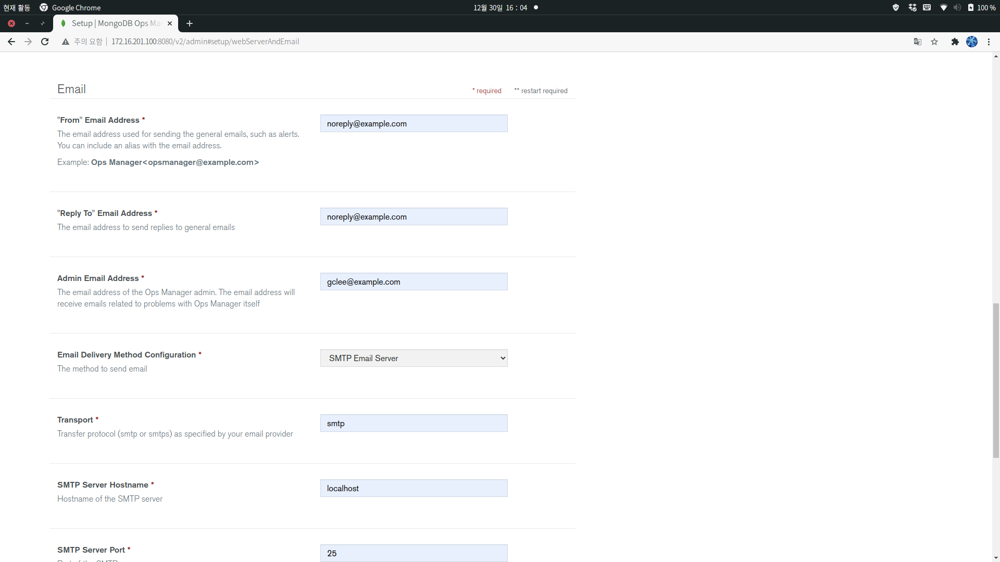

# MongoDB OpsManager

## OpsManager architecure 


https://docs.opsmanager.mongodb.com/current/core/system-overview/ 

## 3 mongo nodes / opsmanager

```yaml
systemLog:
  destination: file

  path: "/var/log/mongodb/mongodb.log"

  logAppend: true
storage:

  dbPath: "/var/lib/mongo"

  journal:
    enabled: true

  wiredTiger:

    engineConfig:

      cacheSizeGB: 1

processManagement:
  fork: true
  timeZoneInfo: /usr/share/zoneinfo
  pidFilePath: /var/run/mongodb/mongod.pid
net:
  bindIp: 127.0.0.1
  port: 27017

setParameter:

  enableLocalhostAuthBypass: false
```
### configure limit

```
mongod          hard      nproc 64000 
mongod          soft      nproc 64000 
mongod          hard      nofile 64000 
mongod          soft      nofile 64000 

mongodb-mms     hard      nproc 64000 
mongodb-mms     soft      nproc 64000 
mongodb-mms     hard      nofile 64000 
mongodb-mms     soft      nofile 64000 
```

### start mongod 

```bash
sudo mkdir /var/run/mongodb
sudo chown mongod:mongod /var/run/mongodb 

sudo -u mongod mongod -f /etc/mongod.conf

wget https://downloads.mongodb.com/on-prem-mms/rpm/mongodb-mms-4.4.6.100.20201201T2030Z-1.x86_64.rpm


sudo rpm -ivh /tmp/mongodb-mms-4.4.6.100.20201201T2030Z-1.x86_64.rpm
```


### start ops manager 
systemctl start mongodb-mms

## Add hosts to Worker nodes 
```
172.17.20.100 opsmongodb0.example.com opsmongodb0 
172.17.20.101 opsmongodb1.example.com opsmongodb1
172.17.20.102 opsmongodb2.example.com opsmongodb2
```

## Install automation agent 
### Download the agent
```
curl -OL http://172.16.201.100:8080/download/agent/automation/mongodb-mms-automation-agent-manager-10.14.17.6445-1.x86_64.rhel7.rpm

and install the package.
sudo rpm -U mongodb-mms-automation-agent-manager-10.14.17.6445-1.x86_64.rhel7.rpm
Open the config file
sudo vi /etc/mongodb-mms/automation-agent.config
and enter your API key, Project ID, and Ops Manager Base URL as shown below.
mmsGroupId=5fec26615f8b63097fdd4ebe
mmsApiKey=<Insert Agent API Key Here>
mmsBaseUrl=http://172.16.201.100:8080

systemctl enable mongodb-mms-automation-agent
systemctl start mongodb-mms-automation-agent
```


## Add mongodb replica node 
- host add 
- install automation agent 
- configure replicaset on ops manager 


# Connect replica set 
```
/var/lib/mongodb-mms-automation/mongodb-linux-x86_64-4.4.2/bin/mongo --host opsmongodb0.example.com --port 27017
```

## BACKUP
backup error occured 
```
MongoD versions greater than 4.2.0+ must be enterprise build to enable backup.
```

## create user 
```json
db.getSiblingDB("admin").createUser({
    user: "admin",
    pwd: "admin",
    roles: [
        { role: "clusterMonitor", db: "admin" },
        { role: "readAnyDatabase", db: "admin" }
    ]
})
```


## capture 





## Reference 
* https://docs.opsmanager.mongodb.com/current/installation/
* https://www.youtube.com/watch?v=AHBDcvcbQ9k&list=PL34sAs7_26wPvZJqUJhjyNtm7UedWR8Ps&index=12